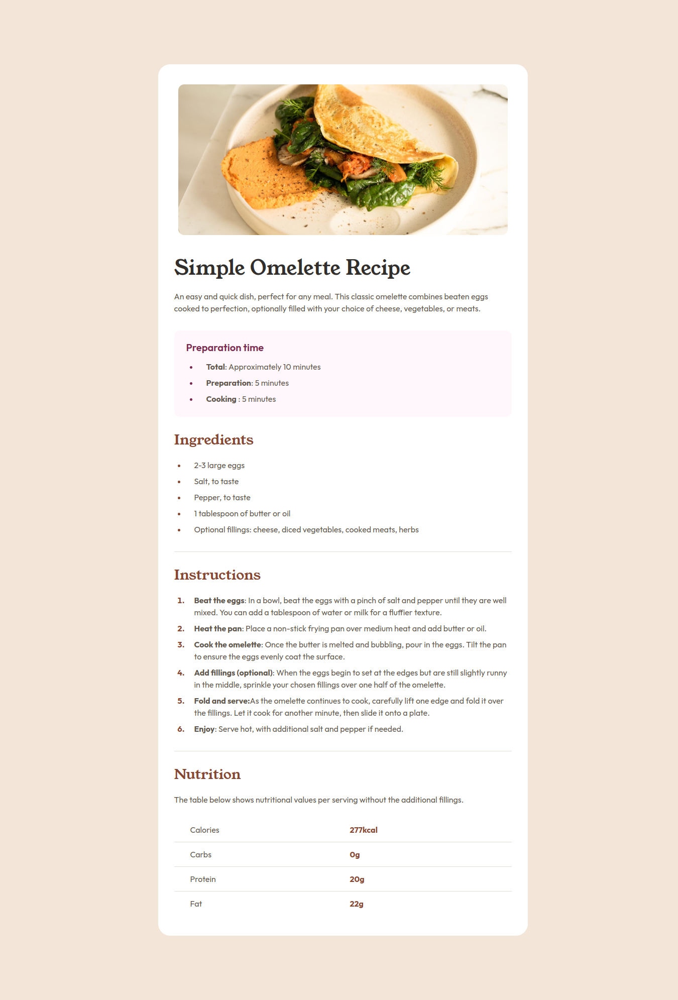

# Frontend Mentor - Recipe page solution

This is a solution to the [Recipe page challenge on Frontend Mentor](https://www.frontendmentor.io/challenges/recipe-page-KiTsR8QQKm). Frontend Mentor challenges help you improve your coding skills by building realistic projects. 

## Table of contents

- [Overview](#overview)
  - [The challenge](#the-challenge)
  - [Screenshot](#screenshot)
  - [Links](#links)
- [My process](#my-process)
  - [Built with](#built-with)
  - [What I learned](#what-i-learned)
  - [Continued development](#continued-development)
  - [Useful resources](#useful-resources)
- [Author](#author)

## Overview

### Screenshot

### Links

- Solution URL: [https://www.frontendmentor.io/solutions/recipe-page-using-only-html-and-css-mobile-first-Xh61NYP8ZV](https://www.frontendmentor.io/solutions/recipe-page-using-only-html-and-css-mobile-first-Xh61NYP8ZV)
- Live Site URL: [https://miguelzaga.github.io/recipe-page/](https://miguelzaga.github.io/recipe-page/)

## My process

### Built with

- Semantic HTML5 markup
- CSS custom properties
- Flexbox
- Mobile-first workflow

### What I learned

I did it to review the vanilla implementation of a site

### Continued development

I need to improve on best practices for responsiveness.

### Useful resources

- [CSS Tools: Reset CSS](https://meyerweb.com/eric/tools/css/reset/) - Great way to reset the default CSS from browsers.

## Author

- Frontend Mentor - [@miguelzaga](https://www.frontendmentor.io/profile/miguelzaga)
